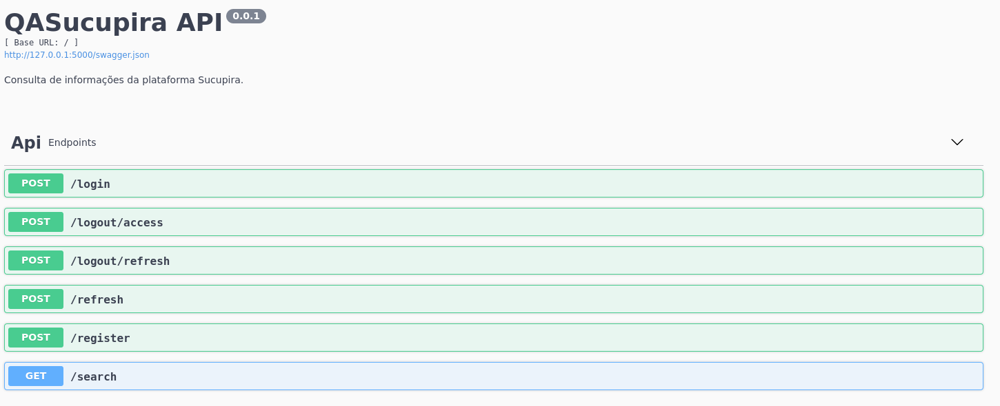

<h1 align="center">IQASucupira API🎓</h1>


> API Interactive Question-Answering do projeto SucupiraBot.

## 📖 Sobre

O IQASucupira é uma ferramenta que foi construída com o objetivo de facilitar a consulta de informações da plataforma Sucupira através de linguagem natural. Na Figura abaixo ilustramos as operações realizadas em nossa API.



## ⚙️ Guia de configuração

1. **Requisitos**

   - Python 3.7
   - PostgreSQL 12

2. **Construindo o ambiente**

   - Crie o seu banco de dados no *PostgreSQL*.

   - No arquivo *.env.sample* insira a [URI de conexão](https://www.postgresql.org/docs/current/libpq-connect.html#LIBPQ-CONNSTRING) do *PostgreSQL* na variável `DB_URL` .

   - Em *.env.sample* forneça também a `SECRET_KEY` utilizada para gerar os *tokens*. Caso não tenha uma ideia do que colocar, você pode gerar uma string aleatória com o código abaixo.

     - ```python
       >>> import uuid
       >>> str(uuid.uuid1())
       '80252c24-ca30-11ea-891b-a9e7a7aa2fcc'
       ```

   - Renomeie o arquivo *.env.sample* para *.env*

   - Por fim, crie um ambiente virtual e instale as dependências do projeto contidas no arquivo *requirements.txt*.

3. **Populando o banco de dados e aplicar *migrations***

   - No terminal, execute os seguintes comandos:

     - ```sh
       $ python manage.py create_db
       $ python manage.py db init
       $ python manage.py db migrate
       ```

4. **Executando a aplicação**

   - Utilize o comando abaixo para executar a aplicação. Você poderá  visualizá-la acessando o seguinte endereço http://127.0.0.1:5000/.

     - ```sh
       $ python manage.py runserver
       ```

   - Caso deseje utilizar outro *host* (`-h`) e *port* (`-p`), utilize o comando a seguir.

     - ```sh
       $ python manage.py runserver -h 0.0.0.0 -p 3000
       ```
5. **Testando a aplicação**

   - A biblioteca utilizada para realizar os testes foi o pytest, você pode executar os testes usando o comando abaixo:

     - ```sh
       $ python manage.py test
       ```
   - Para verificar o nivel de cobertura do test, troque a variavel test por cov
