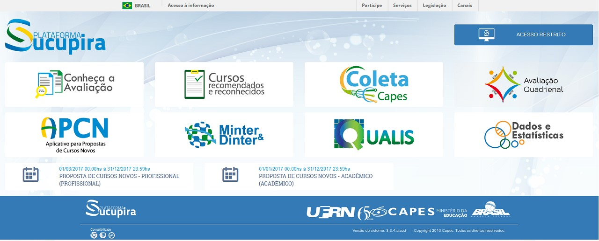

==========
Introdução
==========

O que é o IQASucupira?
----------------------

**IQASucupira** ("IQA" de *Interactive Question-Answering*, Sucupira nome da plataforma de dados) é
uma API escrita em python que tem como objetivo permitir a consulta de informações da Plataforma 
Sucupira através de perguntas escritas em linguagem Natural. O formato o qual modelamos a API, permite
a sua reutilização por clientes HTTP, a fim de facilitar a integração com outros sistemas e assim
acessar as suas funcionalidades através dos verbos HTTP GET e POST. 

Sucupira
'''''''''

A `Plataforma Sucupira`_ consiste em uma ferramenta da CAPES (Coordenação de Aperfeiçoamento de Pessoal de Nível Superior) que reúne e analisa informações dos cursos de pós-graduação do Brasil. Além disso, ela deve garantir a disponibilização desses dados em tempo real, assim garantindo maior transparência sobre esses dados. Na API, por enquanto, contemplamos as informações sobre qualis de periódicos, dissertações e teses e produções intelectuais (artigos em periódicos e trabalhos em anais).

Verbos HTTP
'''''''''''

Através do protocolo HTTP conseguimos realizar o envio e recebido de informações na Web. O **IQASucupira** assume o papel de servidor que responde as solicitações feitas pelo cliente que pode ser um navegador ou um script, por exemplo.

Em algumas consultas da API é necessário informar *token* de autenticação no *header* da requisição. Esse *token* é fornecido pela **IQASucupira**.

Na próxima seção explicamos os métodos de acesso a nossa API e como utilizá-la em conjunto a outro sistema.

.. Links de Referências
.. _Plataforma Sucupira: http://www.capes.gov.br/avaliacao/plataforma-sucupira
